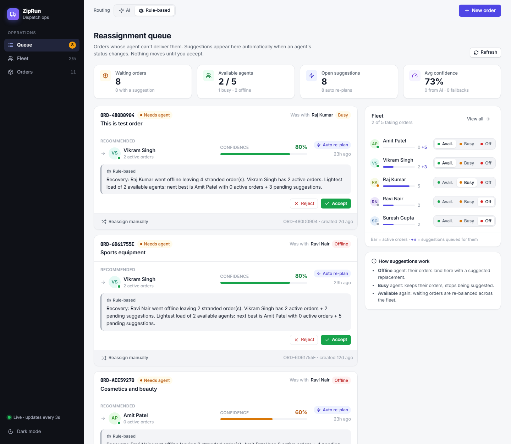
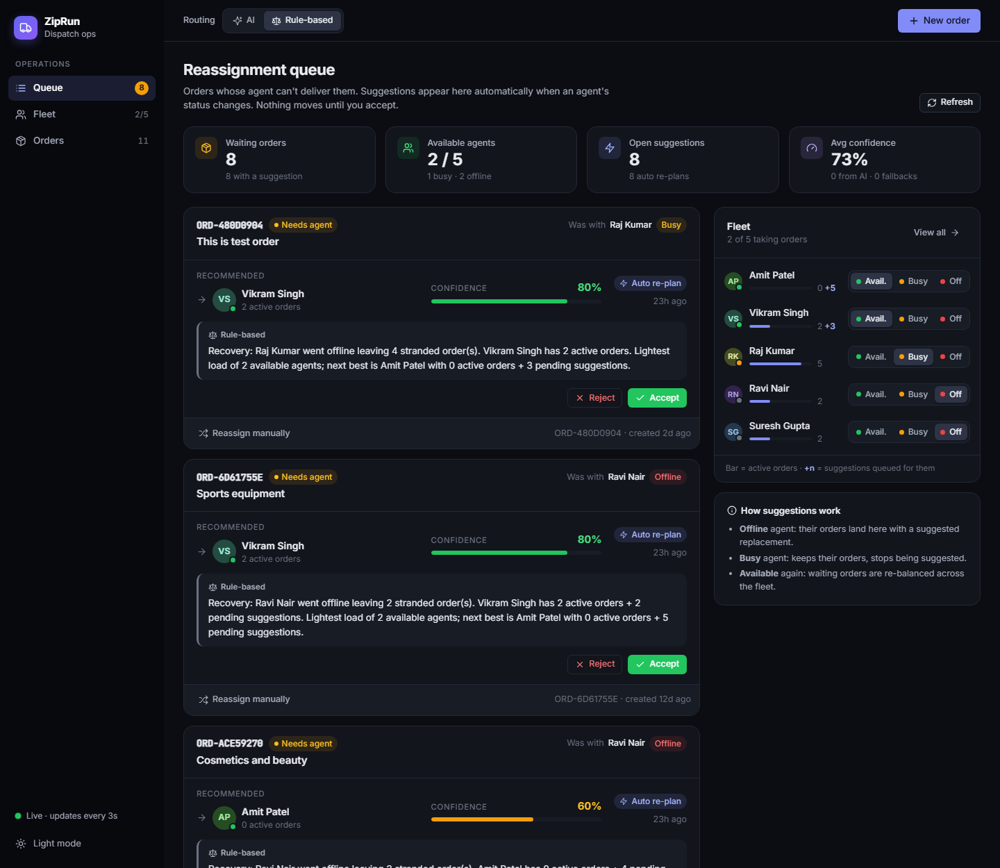
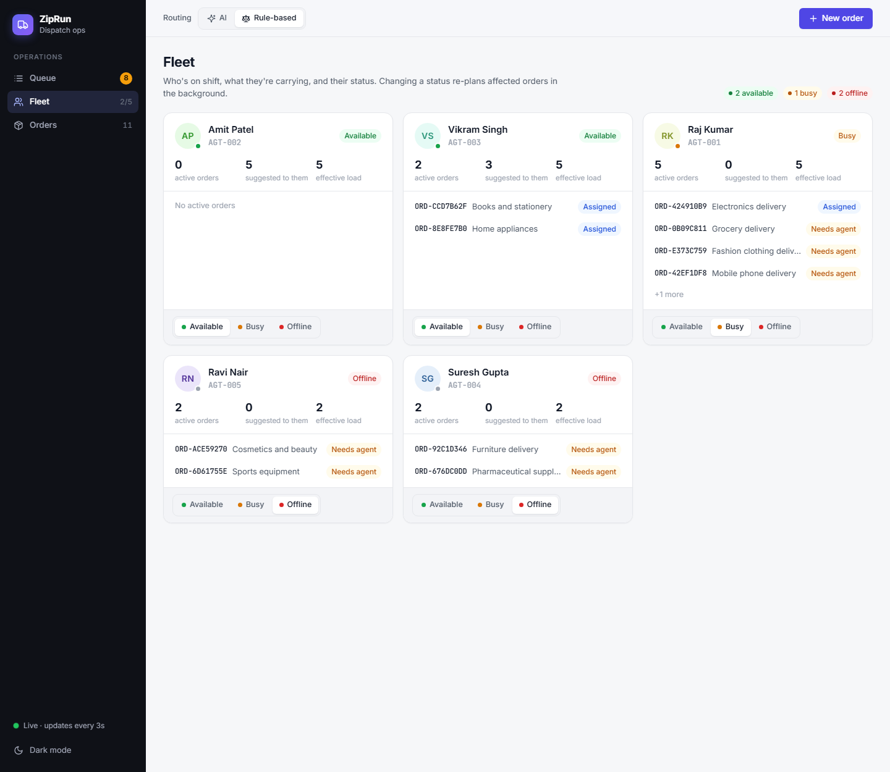
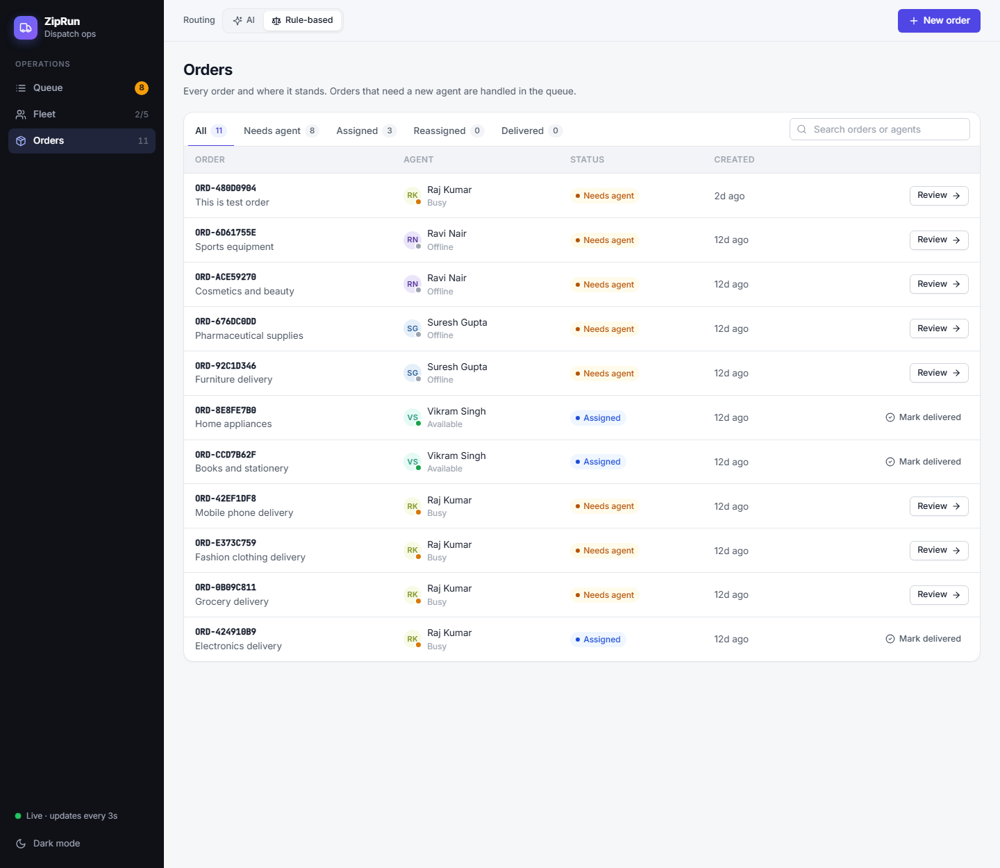
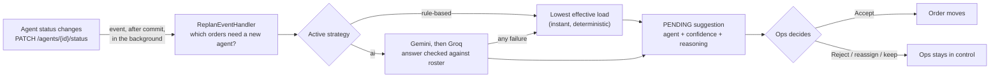

# ZipRun AI Reassignment Engine

[](https://github.com/Pratik41/ziprun-reassignment-engine/actions/workflows/ci.yml)

Delivery fleets assign orders to agents at the start of a shift, and that works until someone calls in sick or a bike breaks down. Then a person has to notice, figure out who has capacity, and move the orders by hand.

This project automates that recovery. When an agent goes offline, the system finds the orders they were carrying, asks an AI (or a deterministic rule-based fallback) who should take each one, and queues those recommendations for an ops person to accept or reject. Nobody has to ask for the suggestions; they appear on their own.



<details>
<summary>More screens: dark mode, Fleet, Orders</summary>





</details>

- **Backend:** Spring Boot 3.3 · Java 17 · H2 · `backend/reassignment-engine`
- **Frontend:** Angular 17 · `frontend/reassignment-ui`
- **How it works (diagrams + detail):** [docs/HOW_IT_WORKS.md](docs/HOW_IT_WORKS.md)
- **Design decisions:** [ADR.md](ADR.md)

## Features

- **Automatic re-planning.** Changing an agent's status triggers a background re-plan. Offline strands their orders; Busy or Offline withdraws suggestions that point at them; becoming Available re-balances everything waiting.
- **Two routing strategies, switchable at runtime:** `ai` (Gemini, with Groq as backup) and `rule-based` (least effective load). New strategies plug in as a single class.
- **AI you can trust:** every recommended agent is checked against the real roster, and any AI failure (timeout, quota, bad JSON, made-up agent) falls back to rule-based. Each suggestion is labelled with what actually produced it, e.g. `ai:gemini` or `rule-based (AI fallback: TIMEOUT)`.
- **Load balancing:** routing counts active orders *plus* suggestions already queued, so a batch of stranded orders is spread across agents instead of piling onto one.
- **Human in the loop:** the system only suggests. Ops accepts, rejects, reassigns manually, or keeps an order with its original agent once they're available again.
- **Live reasoning:** "Get suggestion" streams the AI's explanation as it is generated (Server-Sent Events).
- **Ops console:** queue with KPIs, fleet and orders views, toast notifications, light and dark themes, works down to tablet width.
- **Fleet guardrails:** the last Available agent can't go Busy or Offline, and only Available agents can be given orders.

## Getting started

**Prerequisites:** Java 17+, Maven 3.8+, Node 18+.
An LLM key is optional. Without one, every suggestion comes from the rule-based strategy and is labelled that way.

```bash
# 1. Backend  ->  http://localhost:8080
cd backend/reassignment-engine
export GEMINI_API_KEY=...        # optional: https://aistudio.google.com/app/apikey
export GROQ_API_KEY=...          # optional backup provider: https://console.groq.com/keys
mvn spring-boot:run

# 2. Frontend  ->  http://localhost:4200   (new terminal)
cd frontend/reassignment-ui
npm install
npm start
```

On Windows PowerShell, use `$env:GEMINI_API_KEY="..."` instead of `export`, or run `RUN_PROJECT.bat` and `RUN_FRONTEND.bat`.

On first start an empty database is filled from `data.sql`: 5 agents and 8 orders. Priya Sharma (AGT-001) carries ORD-001, ORD-002 and ORD-008, and Rahul (AGT-002) and Kiran (AGT-004) are the only Available agents. The H2 database lives in `backend/reassignment-engine/data/`; delete that folder to start fresh.

## Try it out

1. Open http://localhost:4200. You land on the **Queue**: KPIs at the top, waiting orders in the middle, and the **Fleet** panel on the right.
2. In the Fleet panel, set **Priya Sharma** to **Off**.
3. Within a few seconds (the UI refreshes every 3s), ORD-001, ORD-002 and ORD-008 appear in the queue, each with an **Auto re-plan** tag, a recommended agent, confidence, reasoning and its source (AI or rule-based). They're spread across Rahul and Kiran.
4. **Accept** one. The order moves to the new agent and both agents' order counts update.
5. **Reject** another, then click **Get suggestion** on it to watch the reasoning stream in.
6. Set **Kiran** to **Busy**. His suggestions are withdrawn and re-planned to Rahul. Set him back to **Available** and the batch is re-balanced across both.
7. Switch **Routing** between **AI** and **Rule-based** in the top bar. It applies to the next suggestion, with no restart.
8. Use **New order** (top right), the **Fleet** page (every agent and their orders) and the **Orders** page (search, filter, mark delivered). The moon icon at the bottom of the sidebar switches to dark mode.

The same flow with curl:

```bash
curl -X PATCH localhost:8080/agents/AGT-001/status -H 'Content-Type: application/json' -d '{"status":"OFFLINE"}'
curl 'localhost:8080/suggestions?status=PENDING'
curl -X PATCH localhost:8080/suggestions/SUGG-XXXX -H 'Content-Type: application/json' -d '{"status":"ACCEPTED"}'
```

## Agent statuses

| Status | Meaning | Gets new orders? |
|---|---|---|
| `AVAILABLE` | On shift and free to take more | Yes |
| `BUSY` | Delivering their current orders, not taking more | No |
| `OFFLINE` | Can't deliver anything; their orders need new agents | No |

| Change | What the system does |
|---|---|
| → `OFFLINE` | Their orders become `REASSIGNMENT_PENDING` and are re-planned; open suggestions recommending them are withdrawn |
| `AVAILABLE` → `BUSY` | Open suggestions recommending them are withdrawn and those orders re-planned; their own orders stay with them |
| → `AVAILABLE` | Every waiting order is re-planned against the larger roster |

## API

| Method | Path | Notes |
|---|---|---|
| `POST` | `/orders` | `{description, assignedAgentId}` → 201 (agent must be `AVAILABLE`) |
| `GET` | `/orders?status=` | `ASSIGNED`, `REASSIGNMENT_PENDING`, `REASSIGNED`, `DELIVERED` |
| `GET` | `/orders/{id}` | |
| `PATCH` | `/orders/{id}/status` | state machine enforced (409 on illegal transition) |
| `POST` | `/orders/{id}/suggest` | runs the active strategy, persists an `INITIAL` suggestion → 201 |
| `POST` | `/orders/{id}/suggest/stream` | same, as Server-Sent Events: `start`, `token` (reasoning text as generated), `restart` (fallback), then `suggestion` or `error` |
| `POST` | `/orders/{id}/reassign` | manual reassign `{newAgentId}` (`AVAILABLE` agents only, not the current one; the order's open suggestions are `EXPIRED`) |
| `POST` | `/orders/{id}/keep` | original agent is `AVAILABLE` again: order returns to `ASSIGNED`, open suggestions `EXPIRED` |
| `GET` | `/agents?status=` | |
| `PATCH` | `/agents/{id}/status` | triggers re-planning in the background and returns immediately; 409 if it would leave no `AVAILABLE` agent |
| `GET` | `/suggestions?status=` | `PENDING`, `ACCEPTED`, `REJECTED`, `EXPIRED` (withdrawn by the system) |
| `PATCH` | `/suggestions/{id}` | `{status: ACCEPTED \| REJECTED}`; accept reassigns the order atomically |
| `GET` / `PUT` | `/routing/strategy` | view / switch the active strategy at runtime `{strategy}` |

Errors always have one shape: `{status, error, message, path, timestamp, details}`, with 400 (bad input), 404 (unknown id) and 409 (conflicts with current state).

## Configuration

All settings live in `application.properties` and can be overridden with environment variables:

| Env var | Default | Meaning |
|---|---|---|
| `ROUTING_STRATEGY` | `ai` | strategy at startup (`ai`, `rule-based`); `PUT /routing/strategy` changes it until the next restart |
| `LLM_PROVIDERS` | `gemini,groq` | providers tried in order; ones without a key are skipped |
| `GEMINI_API_KEY` (or `LLM_API_KEY`) | none | Gemini key |
| `GEMINI_MODEL` | `gemini-3.6-flash` | |
| `GROQ_API_KEY` / `GROQ_MODEL` | none / `openai/gpt-oss-20b` | |
| `LLM_TIMEOUT_MS` | `20000` | per-provider connect/read timeout |

## How it works



**Full explanation with diagrams:** [docs/HOW_IT_WORKS.md](docs/HOW_IT_WORKS.md) covers the agentic loop step by step, how the rule-based and AI strategies decide (with worked numbers), the AI safety net, lifecycles, streaming, guardrails, limitations and troubleshooting.

Key files (under `backend/reassignment-engine/src/main/java/com/ziprun/`):
- `routing/RoutingStrategy.java`: the contract; `routing/strategy/*`: the implementations
- `routing/RoutingService.java`: candidates, runtime switch, safety-net fallback
- `routing/RoutingContext.java`: initial vs recovery context and pending load
- `service/ai/PromptBuilder.java`: the initial and re-plan prompts
- `routing/gateway/*`: provider chain, timeouts, typed `LLMException`
- `service/event/ReplanEventHandler.java`: the agentic loop
- `service/suggestion/SuggestionServiceImpl.java`: idempotency, accept/reject, keep and manual reassign

## Tests

```bash
cd backend/reassignment-engine
mvn test
```

41 tests, run on every push by GitHub Actions. They need no API keys: they use an in-memory database and a test-only fake LLM.
- **Unit:** rule-based ranking and confidence, AI validation and every fallback path, response parsing, prompt differences, provider chain, incremental reasoning extraction.
- **End-to-end** (HTTP + background loop + H2): offline → spread suggestions → accept → loads updated; idempotent re-trigger; sibling suggestions rejected on accept; runtime strategy switch; stale suggestions withdrawn when their agent goes busy or offline; re-balance when an agent becomes available; recommendation refused if the agent went offline mid-routing; keep with original agent; manual reassign; last Available agent protected; structured errors; async fallback when the AI makes up an agent; SSE streaming, including fallback.

## Roadmap

- **Zone-aware routing:** a `ZoneAffinityStrategy` using the existing `pickupZone` / `dropoffZone` / `currentZone` fields.
- **Capacity limits:** enforce `Agent.maxCapacity` when choosing candidates.
- **SLA-driven re-planning:** re-plan proactively as `Order.slaDeadline` approaches, not only when an agent goes offline.
- **Schema migrations** with Flyway, and Postgres instead of H2.
- **Authentication** for the API and ops console.
- **Push updates** (SSE/WebSocket) to the UI instead of polling.

Design reasoning for each of these, and for what's already built, is in [ADR.md](ADR.md).
