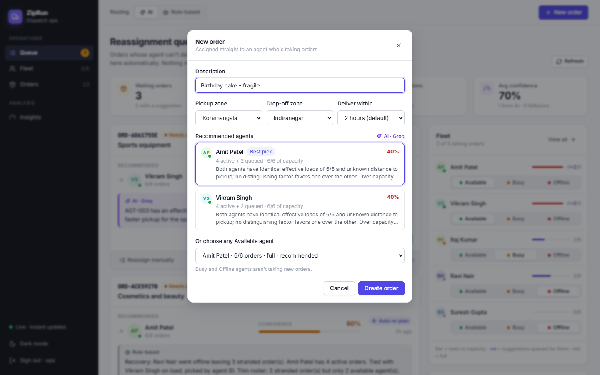
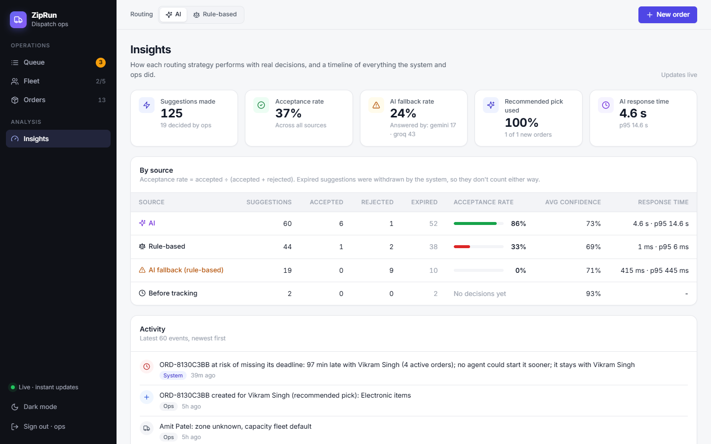
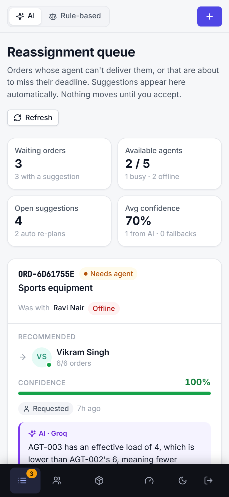
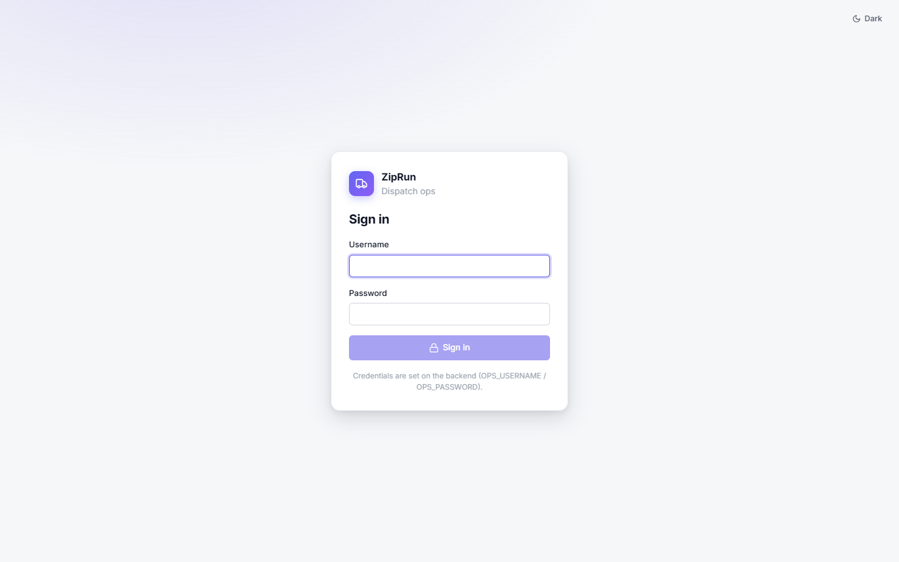
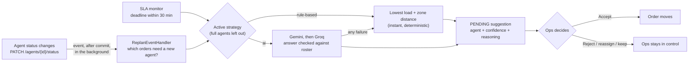

# ZipRun AI Reassignment Engine

[](https://github.com/Pratik41/ziprun-reassignment-engine/actions/workflows/ci.yml)

Delivery fleets assign orders to agents at the start of a shift, and that works until someone calls in sick or a bike breaks down. Then a person has to notice, figure out who has capacity, and move the orders by hand.

This project automates that recovery. When an agent goes offline, or an order is about to miss its deadline, the system finds the orders affected, asks an AI (or a deterministic rule-based fallback) who should take each one, considering load, capacity and location, and queues those recommendations for an ops person to accept or reject. Nobody has to ask for the suggestions; they appear on their own, live.


<details>
<summary>More screens: New order recommendations, Insights, Fleet, Orders, dark mode, phone, sign-in</summary>

**New order:** the active strategy recommends agents by load, capacity and distance to the pickup zone (here everyone is at capacity, so it says so and confidence is capped)


**Insights:** AI vs rule-based acceptance, fallback rate, response time, and the activity log


**Fleet:** load against capacity (red = full), zone and capacity per agent


**Orders:** every order with its route and deadline


**Dark mode**


**Phone:** bottom tab bar


**Sign-in**


</details>

- **Backend:** Spring Boot 3.3 · Java 17 · Spring Security · Flyway · PostgreSQL (Docker) or H2 (local) · `backend/reassignment-engine`
- **Frontend:** Angular 17 · `frontend/reassignment-ui`
- **How it works (diagrams + detail):** [docs/HOW_IT_WORKS.md](docs/HOW_IT_WORKS.md)
- **Design decisions:** [ADR.md](ADR.md)

## Features

- **Automatic re-planning.** Changing an agent's status triggers a background re-plan. Offline strands their orders; Busy or Offline withdraws suggestions that point at them; becoming Available re-balances everything waiting.
- **Automatic offline detection:** agents' phone apps send a heartbeat (`POST /agents/{id}/heartbeat`). If it stops for 60 seconds, the agent is marked Offline and their orders are re-planned, with nobody clicking anything. The Fleet page can simulate an agent's app.
- **Deadline re-planning:** every order has a delivery deadline. When one is within 30 minutes of it and another agent could start it sooner, a suggestion to move it appears under **Deadline at risk**, without anyone going offline.
- **Capacity limits:** each agent has a capacity (their own, or the fleet default of 6). Agents at their limit aren't suggested; if everyone is full, the suggestion says so and its confidence is capped.
- **Zone-aware routing:** agents and orders have Bengaluru zones; routing prefers an agent in or next to the pickup zone and says so in the reasoning.
- **Two routing strategies, switchable at runtime:** `ai` (Gemini, with Groq as backup) and `rule-based` (least load, nearest zone). The choice is saved and survives restarts. New strategies plug in as a single class.
- **AI you can trust:** every recommended agent is checked against the real roster, and any AI failure (timeout, quota, bad JSON, made-up agent) falls back to rule-based. Each suggestion is labelled with what actually produced it, e.g. `ai:gemini` or `rule-based (AI fallback: TIMEOUT)`. A provider that keeps failing is paused for 5 minutes (circuit breaker), so one slow provider doesn't add a 20-second wait to every AI call. Confidence is capped when the roster is thin, so no strategy can claim certainty it doesn't have.
- **Insights:** acceptance rate, confidence and response time per strategy (AI vs rule-based vs fallback), the AI fallback rate, and an activity log of everything ops and the system did.
- **Recommended agent for new orders:** the New order dialog asks the active strategy for the top 3 Available agents (lightest effective load first; the AI also weighs the description), pre-selects the best one and shows why. Ops can still pick anyone; Insights tracks how often the recommended agent is used.
- **Load balancing:** routing counts active orders *plus* suggestions already queued, so a batch of stranded orders is spread across agents instead of piling onto one.
- **Human in the loop:** the system only suggests. Ops accepts, rejects, reassigns manually, or keeps an order with its original agent once they're available again.
- **Live:** the server pushes a change event the moment anything is saved, so every open console updates instantly (no polling). "Get suggestion" streams the AI's explanation as it is generated.
- **Sign-in and security:** the console and API need a login (session cookie with CSRF protection, or HTTP Basic for scripts); repeated wrong passwords are locked out; agents' phone apps use their own token for heartbeats.
- **Ops console:** queue with KPIs, fleet and orders views, toast notifications, light and dark themes, responsive down to phone width (bottom tab bar on small screens).
- **Fleet guardrails:** the last Available agent can't go Busy or Offline, and only Available agents can be given orders.
- **Production basics:** PostgreSQL with Flyway migrations in Docker, one-command startup, and CI that tests the backend on H2 and PostgreSQL, the frontend, and the running Docker stack.

## Getting started

An LLM key is optional. Without one, every suggestion comes from the rule-based strategy and is labelled that way.

### With Docker (one command)

Needs only Docker (Docker Desktop on Windows/macOS).

```bash
cp .env.example .env        # then set OPS_PASSWORD (required, 10+ characters); API keys optional
docker compose up --build
```

Open http://localhost:4200 and sign in as **ops** with the `OPS_PASSWORD` you set. Docker runs the backend with the `prod` profile, which **refuses to start** with the default password, sign-in turned off or the H2 console on, so a forgotten default can't ship. The data lives in PostgreSQL in a Docker volume, so it survives restarts; `docker compose down -v` resets it. The backend's port 8080 is only reachable from your own machine; everyone else goes through the UI's nginx.

The UI calls the API on its own address under `/api` (nginx forwards it to the backend), so it also works when opened from another machine or a phone. To point the UI container at a backend somewhere else, set `BACKEND_URL` on the `frontend` service (default `http://backend:8080`).

### Without Docker

**Prerequisites:** Java 17+, Maven 3.8+, Node 18+.

```bash
# 1. Backend  ->  http://localhost:8080
cd backend/reassignment-engine
export GEMINI_API_KEY=...        # optional: https://aistudio.google.com/app/apikey
export GROQ_API_KEY=...          # optional backup provider: https://console.groq.com/keys
mvn spring-boot:run

# 2. Frontend  ->  http://localhost:4200   (new terminal)
cd frontend/reassignment-ui
npm install
npm start
```

On Windows PowerShell, use `$env:GEMINI_API_KEY="..."` instead of `export`, or run `RUN_PROJECT.bat` and `RUN_FRONTEND.bat`.

The dev server forwards `/api/*` to the backend on port 8080 (`proxy.conf.json`), so there's no backend address to configure. To open the console from your phone on the same Wi-Fi, start it with `npx ng serve --host 0.0.0.0` and browse to `http://<your-computer's-IP>:4200`.

Sign in as **ops** / **ziprun** (or whatever `OPS_USERNAME` / `OPS_PASSWORD` say).

The schema and sample data come from Flyway migrations (`src/main/resources/db/migration`): 5 agents in different zones and 8 orders. Priya Sharma (AGT-001, Koramangala) carries ORD-001, ORD-002 and ORD-008, and Rahul (AGT-002, HSR Layout) and Kiran (AGT-004, Malleshwaram) are the only Available agents. Locally the database is an H2 file in `backend/reassignment-engine/data/`; delete that folder to start fresh. Set `DATABASE_URL` (and `DATABASE_USERNAME` / `DATABASE_PASSWORD`) to use PostgreSQL instead.

## Try it out

1. Open http://localhost:4200 and sign in. You land on the **Queue**: KPIs at the top, waiting orders in the middle, and the **Fleet** panel on the right.
2. In the Fleet panel, set **Priya Sharma** to **Offline**.
3. ORD-001, ORD-002 and ORD-008 appear in the queue straight away (the server pushes the change), each with an **Auto re-plan** tag, a recommended agent, confidence, reasoning and its source (AI or rule-based). They're spread across Rahul and Kiran, and the reasoning mentions each agent's zone and load against capacity.
4. **Accept** one. The order moves to the new agent and both agents' order counts update.
5. **Reject** another, then click **Get suggestion** on it to watch the reasoning stream in.
6. Set **Kiran** to **Busy**. His suggestions are withdrawn and re-planned to Rahul. Set him back to **Available** and the batch is re-balanced across both.
7. Switch **Routing** between **AI** and **Rule-based** in the top bar. It applies to the next suggestion, with no restart, and is remembered after restarts.
8. On the **Fleet** page, click **Connect app** for an Available agent (simulating their phone), then **Disconnect app**. About 60 seconds later the system marks them Offline by itself and their orders appear in the queue.
9. On the **Fleet** page, set an agent's **zone** and **capacity** (e.g. Rahul, capacity 1). Load bars turn red at capacity and that agent stops being suggested.
10. Click **New order**, pick a **pickup zone** and watch the recommendations change; choose **Deliver within 30 min** and give it to an agent who already has a couple of orders. Within about 30 seconds the deadline monitor flags it, and if another agent could start it sooner it shows up under **Deadline at risk** in the queue.
11. Open **Insights** to compare AI and rule-based acceptance rates and read the activity log.
12. The **Orders** page shows each order's route and deadline (search, filter, mark delivered). The moon icon at the bottom of the sidebar switches to dark mode; **Sign out** is underneath.

The same flow with curl (scripts sign in with HTTP Basic):

```bash
curl -u ops:ziprun -X PATCH localhost:8080/agents/AGT-001/status -H 'Content-Type: application/json' -d '{"status":"OFFLINE"}'
curl -u ops:ziprun 'localhost:8080/suggestions?status=PENDING'
curl -u ops:ziprun -X PATCH localhost:8080/suggestions/SUGG-XXXX -H 'Content-Type: application/json' -d '{"status":"ACCEPTED"}'
curl -u ops:ziprun -N localhost:8080/events      # watch the live change events
```

## Agent statuses

| Status | Meaning | Gets new orders? |
|---|---|---|
| `AVAILABLE` | On shift and free to take more | Yes |
| `BUSY` | Delivering their current orders, not taking more | No |
| `OFFLINE` | Can't deliver anything; their orders need new agents | No |

| Change | What the system does |
|---|---|
| → `OFFLINE` (by ops, or automatically when their app's heartbeats stop) | Their orders become `REASSIGNMENT_PENDING` and are re-planned; open suggestions recommending them are withdrawn |
| `AVAILABLE` → `BUSY` | Open suggestions recommending them are withdrawn and those orders re-planned; their own orders stay with them |
| → `AVAILABLE` | Every waiting order is re-planned against the larger roster |

## API

Everything except `/auth/**` needs a signed-in user: the session cookie from `POST /auth/login` (writes must echo the `XSRF-TOKEN` cookie in an `X-XSRF-TOKEN` header, which the console does), or HTTP Basic. Without one the answer is 401.

| Method | Path | Notes |
|---|---|---|
| `POST` | `/auth/login` | `{username, password}` → 200 + session cookie; 401 wrong; 429 after 5 failures (10-minute lockout) |
| `GET` | `/auth/me` | who is signed in (401 if nobody) |
| `POST` | `/auth/logout` | 204 |
| `GET` | `/events` | Server-Sent Events: `change {topics}` whenever agents, orders, suggestions, activity or settings change |
| `GET` | `/config` | zones (with neighbours), default capacity, default deadline and the at-risk window |
| `POST` | `/orders` | `{description, assignedAgentId, recommendedAgentId?, pickupZone?, dropoffZone?, slaMinutes?}` → 201 (agent must be `AVAILABLE`; `slaMinutes` null = default deadline, 0 = none; `recommendedAgentId` records the pick that was shown) |
| `GET` | `/orders?status=` | `ASSIGNED`, `REASSIGNMENT_PENDING`, `REASSIGNED`, `DELIVERED` |
| `GET` | `/orders/{id}` | |
| `PATCH` | `/orders/{id}/status` | state machine enforced (409 on illegal transition) |
| `POST` | `/orders/{id}/suggest` | runs the active strategy, persists an `INITIAL` suggestion → 201 |
| `POST` | `/orders/{id}/suggest/stream` | same, as Server-Sent Events: `start`, `token` (reasoning text as generated), `restart` (fallback), then `suggestion` or `error` |
| `POST` | `/orders/{id}/reassign` | manual reassign `{newAgentId}` (`AVAILABLE` agents only, not the current one; the order's open suggestions are `EXPIRED`) |
| `POST` | `/orders/{id}/keep` | original agent is `AVAILABLE` again: order returns to `ASSIGNED`, open suggestions `EXPIRED` |
| `GET` | `/agents?status=` | |
| `PATCH` | `/agents/{id}/status` | triggers re-planning in the background and returns immediately; 409 if it would leave no `AVAILABLE` agent |
| `PATCH` | `/agents/{id}` | `{currentZone, maxCapacity}`: null zone = unknown, null capacity = fleet default |
| `POST` | `/agents/{id}/heartbeat` | the agent's phone app checking in (header `X-Agent-Token: $AGENT_APP_TOKEN`, or a signed-in user); no heartbeat for `AGENTS_HEARTBEAT_TIMEOUT_SECONDS` → automatic `OFFLINE` |
| `GET` | `/suggestions?status=` | `PENDING`, `ACCEPTED`, `REJECTED`, `EXPIRED` (withdrawn by the system) |
| `PATCH` | `/suggestions/{id}` | `{status: ACCEPTED \| REJECTED}`; accept reassigns the order atomically |
| `GET` / `PUT` | `/routing/strategy` | view / switch the active strategy at runtime `{strategy}` (saved, survives restarts) |
| `GET` | `/routing/providers` | AI providers in order with circuit-breaker state: `CLOSED` (in use), `OPEN` (paused until `openUntil`), `HALF_OPEN` (next call is a trial) |
| `POST` | `/routing/recommend` | `{description?, pickupZone?, dropoffZone?}` → top 3 Available agents for a new order from the active strategy, best first; nothing is saved |
| `GET` | `/metrics` | suggestion outcomes per source (AI / rule-based / fallback): acceptance rate, confidence, response time; how often new orders went to the recommended agent |
| `GET` | `/activity?limit=50` | activity log, newest first: who did what, when (`ops` or `system`) |

**Lists** (`/orders`, `/agents`, `/suggestions`) take optional `?page=0&size=500` (newest first, max 1000 per page); the body stays a plain array and the total is in the `X-Total-Count` header. **Timestamps** carry their UTC offset (`2026-10-07T14:32:10+05:30`). Responses are dedicated records, not database entities, so internal fields never leak.

Errors always have one shape: `{status, error, message, path, timestamp, details}`, with 400 (bad input), 404 (unknown id), 409 (conflicts with current state, or someone else changed the same thing at the same moment), and 503 (every "Get suggestion" stream slot busy).

## Configuration

All settings live in `application.properties` and can be overridden with environment variables:

| Env var | Default | Meaning |
|---|---|---|
| `SPRING_PROFILES_ACTIVE` | `dev` | `dev` = laptop defaults allowed. `prod` (Docker) refuses to start with the default/short password, sign-in off or the H2 console on |
| `OPS_USERNAME` / `OPS_PASSWORD` | `ops` / `ziprun` (dev only) | the console and API login. In `prod` the password must be set and at least 10 characters |
| `LOG_LEVEL` | `INFO` | `DEBUG` also logs every AI prompt and reply; don't ship that |
| `DEMO_TOOLS` | on in dev, off in prod | the Fleet page's phone-app simulator |
| `AGENT_APP_TOKEN` | none | shared secret agents' phone apps send as `X-Agent-Token` on heartbeats; unset = only signed-in users can send them |
| `CORS_ALLOWED_ORIGINS` | `http://localhost:4200` | exact origins allowed to call the API cross-origin (the console itself uses same-origin `/api`); empty = none |
| `DATABASE_URL` / `DATABASE_USERNAME` / `DATABASE_PASSWORD` | H2 file in `./data` | e.g. `jdbc:postgresql://localhost:5432/ziprun`; Docker Compose sets these |
| `AGENTS_DEFAULT_MAX_CAPACITY` | `6` | most orders (active + queued suggestions) routing gives an agent without their own capacity; `0` = no limit |
| `ORDERS_DEFAULT_SLA_MINUTES` | `120` | deadline for new orders (the New order dialog can pick another, or none) |
| `ORDERS_SLA_AT_RISK_MINUTES` | `30` | orders this close to their deadline are flagged and, if someone could start them sooner, re-planned |
| `ROUTING_STRATEGY` | `ai` | first-run strategy (`ai`, `rule-based`); once someone switches in the UI, the saved choice wins |
| `AGENTS_HEARTBEAT_TIMEOUT_SECONDS` | `60` | an agent whose app sent heartbeats but then stops for this long is marked Offline |
| `LLM_PROVIDERS` | `gemini,groq` | providers tried in order; ones without a key are skipped |
| `GEMINI_API_KEY` (or `LLM_API_KEY`) | none | Gemini key |
| `GEMINI_MODEL` | `gemini-3.6-flash` | |
| `GROQ_API_KEY` / `GROQ_MODEL` | none / `openai/gpt-oss-20b` | |
| `LLM_TIMEOUT_MS` | `20000` | per-provider connect/read timeout |
| `LLM_CIRCUIT_FAILURE_THRESHOLD` | `2` | failures in a row before a provider is paused (circuit breaker) |
| `LLM_CIRCUIT_COOLDOWN_SECONDS` | `300` | how long a paused provider is skipped; then one trial call decides if it's back |
| `H2_CONSOLE_ENABLED` | `false` | H2's web console at `/h2-console` (local H2 only, behind sign-in) |

## How it works



**Full explanation with diagrams:** [docs/HOW_IT_WORKS.md](docs/HOW_IT_WORKS.md) covers the agentic loop step by step, how the rule-based and AI strategies decide (with worked numbers), capacity, zones and deadlines, the AI safety net, lifecycles, live updates, sign-in, the database, guardrails, limitations and troubleshooting.

Key files (under `backend/reassignment-engine/src/main/java/com/ziprun/`):
- `routing/RoutingStrategy.java`: the contract; `routing/strategy/*`: the implementations
- `routing/RoutingService.java`: candidates, capacity, runtime switch, safety-net fallback
- `routing/RoutingContext.java`: initial / recovery / deadline context, pending load, capacity
- `routing/Zones.java`: zones and which border each other
- `service/order/SlaMonitor.java`: deadline re-planning
- `service/live/*`: change events pushed to consoles (`GET /events`)
- `config/SecurityConfig.java`, `controller/AuthController.java`: sign-in, CSRF, agent token
- `resources/db/migration/*`: the schema (Flyway)
- `service/ai/PromptBuilder.java`: the initial and re-plan prompts
- `routing/gateway/*`: provider chain, timeouts, typed `LLMException`
- `service/event/ReplanEventHandler.java`: the agentic loop
- `service/suggestion/SuggestionServiceImpl.java`: idempotency, accept/reject, keep and manual reassign

## Tests

```bash
cd backend/reassignment-engine && mvn test                       # 92 backend tests
cd frontend/reassignment-ui && npx ng test --watch=false        # 29 frontend tests (needs Chrome)
```

All run on every push by GitHub Actions, which also runs the main flow against a real PostgreSQL, builds the Docker images and smoke-tests the running stack (including sign-in). They need no API keys: they use an in-memory database and a test-only fake LLM.
- **Unit:** rule-based ranking, zone distance and confidence, capacity limits (own, default, queued suggestions, everyone full), AI validation and every fallback path, response parsing, prompt differences, provider chain and circuit breaker, incremental reasoning extraction, saved strategy on restart, thin-roster confidence cap.
- **Security:** 401 without sign-in, session + CSRF (writes refused without the token), lockout after 5 wrong passwords, HTTP Basic for scripts, the agent-app token works for heartbeats only; `prod` refuses unsafe settings; typed text can't break out of its place in the AI prompt.
- **Concurrency and API shape:** a stale copy can't overwrite a newer change (optimistic locking); two withdrawals of the same suggestions don't conflict; responses carry no internal fields; lists are paged; timestamps carry their offset; ids don't collide.
- **Deadlines, zones, live:** orders get zones and deadlines; an at-risk order gets one suggestion for a faster agent (or stays put); delivering withdraws it; zone and capacity edits change the ranking; change events are pushed after commit.
- **Frontend:** deadline and label helpers, the store's capacity and queue order, the auth service and 401 handling, and the New order dialog's recommendation flow.
- **End-to-end** (HTTP + background loop + H2): offline → spread suggestions → accept → loads updated; idempotent re-trigger; sibling suggestions rejected on accept; runtime strategy switch; stale suggestions withdrawn when their agent goes busy or offline; re-balance when an agent becomes available; recommendation refused if the agent went offline mid-routing; keep with original agent; manual reassign; last Available agent protected; structured errors; async fallback when the AI makes up an agent; SSE streaming, including fallback; heartbeat auto-offline (and manual override); activity log and metrics; new-order recommendations (lighter agent first, nothing saved, followed/overridden recorded).

## Roadmap

- **A real agent app** sending heartbeats with `AGENT_APP_TOKEN` (the Fleet page simulates one today), ideally with live GPS so zones update themselves.
- **Accounts and roles:** today there is one ops login; named users would put a real name on every activity entry.
- **Travel time instead of zones:** coordinates and a routing API would replace the coarse same / neighbour / far distance.
- **More than one backend instance:** live-update connections, the sign-in lockout and the AI circuit breakers are kept in memory per instance; they'd move to a shared store (e.g. Redis) behind a load balancer.
- **Metrics export** (Prometheus / OpenTelemetry) alongside the Insights page.

Design reasoning for each of these, and for what's already built, is in [ADR.md](ADR.md).
