# How ZipRun works

This guide explains the whole system: what happens when an agent's status changes, how the **rule-based** and **AI** strategies each pick an agent, what protects the AI path from bad answers, and the rules that keep the data consistent. Diagrams are drawn with Mermaid, which GitHub renders automatically.

Code paths are relative to `backend/reassignment-engine/src/main/java/com/ziprun/`.

**Contents**
1. [The big picture](#1-the-big-picture)
2. [The core idea: suggestions, not assignments](#2-the-core-idea-suggestions-not-assignments)
3. [The agentic loop: what happens when an agent's status changes](#3-the-agentic-loop)
4. [How an agent is chosen: the routing pipeline](#4-how-an-agent-is-chosen-the-routing-pipeline)
5. [Rule-based strategy in detail](#5-rule-based-strategy-in-detail)
6. [AI strategy in detail](#6-ai-strategy-in-detail)
7. [Saving a suggestion safely](#7-saving-a-suggestion-safely)
8. [The ops decisions: accept, reject, reassign, keep](#8-the-ops-decisions)
9. [Lifecycles: orders, suggestions, agents](#9-lifecycles)
10. [Live reasoning (SSE streaming)](#10-live-reasoning-sse-streaming)
11. [Fleet rules and guardrails](#11-fleet-rules-and-guardrails)
12. [Things you might not know](#12-things-you-might-not-know)
13. [Known limitations](#13-known-limitations)
14. [Troubleshooting](#14-troubleshooting)
15. [History and metrics (Insights)](#15-history-and-metrics-insights)

---

## 1. The big picture

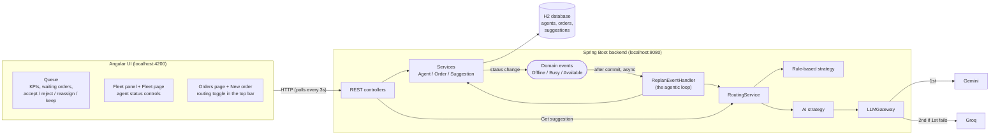

Three moving parts:

| Part | Job |
|---|---|
| **Services** | Own the data and its rules: order state machine, agent load, suggestion lifecycle. |
| **Agentic loop** (`service/event/ReplanEventHandler`) | Reacts to agent status changes in the background and decides which orders need a new suggestion. |
| **Routing** (`routing/*`) | Answers one question for one order: *"which agent should take this?"*, using the active strategy. |

The UI never talks to the AI directly. It only reads data and sends ops decisions; everything else happens on the server.

---

## 2. The core idea: suggestions, not assignments

The system **never moves an order on its own**. It creates a **suggestion**: a recommended agent, a confidence score (0–1), a plain-English reason, and a tag showing what produced it. A human then accepts or rejects it.

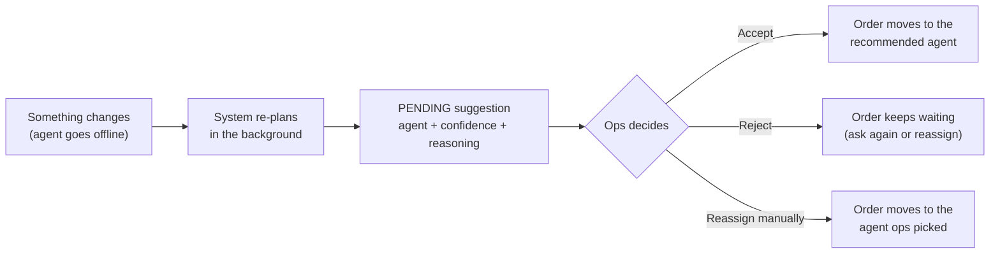

Why: a wrong automatic reassignment (sending an order to someone who can't take it) costs more than the minute it takes a person to click Accept. ADR-9 lists the conditions under which auto-accept could be allowed later.

Each suggestion records:

| Field | Example | Meaning |
|---|---|---|
| `recommendedAgentId` | `AGT-004` | who should take the order |
| `confidence` | `0.80` | how clear-cut the choice is |
| `reasoning` | "Kiran Nair has 0 active orders…" | shown to ops word for word |
| `triggerReason` | `AGENT_OFFLINE` / `INITIAL` | created by the loop (**⚡ Auto re-plan** tag) or by "Get suggestion" (**Requested**) |
| `source` | `ai:gemini`, `rule-based`, `rule-based (AI fallback: TIMEOUT)` | what *actually* produced it |
| `status` | `PENDING` → `ACCEPTED` / `REJECTED` / `EXPIRED` | see [section 9](#9-lifecycles) |

---

## 3. The agentic loop

Every agent status change goes through `AgentServiceImpl.updateStatus`, which saves the new status and publishes an **event**. The loop handles the event **after the database commit, on a background thread**, so the button click returns immediately.

### Which change fires which event

| Change | Event | What the loop does |
|---|---|---|
| any → `OFFLINE` | `AgentOfflineEvent` | Their orders are stranded: mark them `REASSIGNMENT_PENDING` and re-plan them. Withdraw open suggestions *recommending* them and re-plan those orders too. |
| `AVAILABLE` → `BUSY` | `AgentBusyEvent` | Their own orders stay with them (they're still delivering). Withdraw open suggestions recommending them and re-plan those orders. |
| `BUSY`/`OFFLINE` → `AVAILABLE` | `AgentAvailableEvent` | More capacity: withdraw the open suggestions of **every** waiting order and re-plan all of them, so they spread across the bigger roster. |
| `OFFLINE` → `BUSY` | none | The agent wasn't taking orders before and still isn't; nothing to re-plan. |

### Automatic offline detection (heartbeats)

A person doesn't have to notice that someone dropped out. Each agent's phone app calls `POST /agents/{id}/heartbeat` every few seconds. A background check (`service/agent/HeartbeatMonitor`, every 5 s) looks for on-duty agents whose last heartbeat is older than `AGENTS_HEARTBEAT_TIMEOUT_SECONDS` (default 60) and marks them `OFFLINE`. That publishes the same `AgentOfflineEvent`, so everything below happens exactly as if ops had clicked Offline.

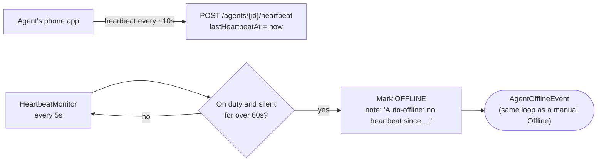

- **Only agents whose app has reported are monitored.** An agent with no `lastHeartbeatAt` is never auto-offlined, so agents managed by hand are unaffected.
- **It's a fact, not a request,** so the "keep one agent Available" guardrail doesn't block it.
- **The app reconnecting doesn't put them back on duty.** The note changes to "App reconnected…", but whether they're back on shift is ops' decision.
- **A manual status change wins.** It clears the note and pauses monitoring until the app sends its next heartbeat, so a stale heartbeat can't immediately flip the agent back.
- **Try it:** on the Fleet page, **Connect app** simulates an agent's phone (a heartbeat every 10 s from your browser). **Disconnect app** and watch them go Offline about a minute later.

### Step by step: an agent goes offline

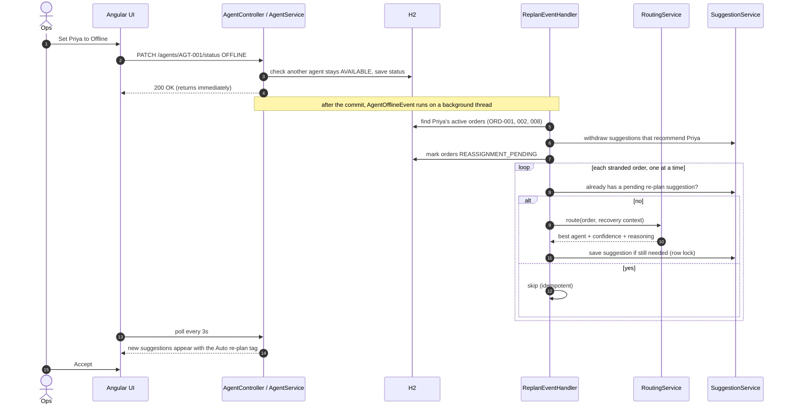

Things worth noticing:

- **The click is never slowed down by the AI.** The PATCH returns before any AI call starts.
- **Orders are processed one at a time.** Each saved suggestion counts toward the next order's routing (see *effective load* in [section 5](#5-rule-based-strategy-in-detail)), which is how a batch gets spread out.
- **Each step is its own small database transaction.** An 8-second AI call never holds a database connection, and one failing order can't undo the others.
- **Running twice is harmless.** An order that already has a pending re-plan suggestion is skipped.
- **The AI is told *who* stranded each order.** Orders are grouped by their assigned agent, so the incident report names the right person even when the re-plan was triggered by someone else becoming Busy or Available.

---

## 4. How an agent is chosen: the routing pipeline

Every caller uses the same pipeline (`RoutingService.rank(order, context)`):
- the agentic loop, with a **recovery** context (who failed, the whole stranded batch)
- the "Get suggestion" button / `POST /orders/{id}/suggest`, with an **initial** context
- the **New order** dialog / `POST /routing/recommend`, with an initial context and a draft order that isn't saved (see below)

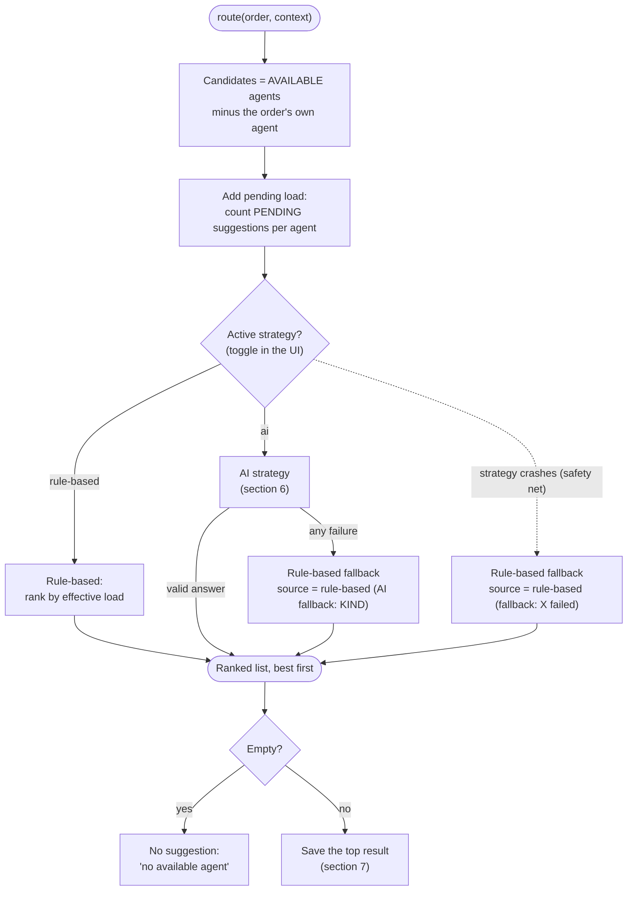

- **Candidates** are only `AVAILABLE` agents. Busy agents are still delivering and don't take more; Offline agents can't.
- **The order's own agent is excluded**, because "reassign to the same person" isn't a reassignment. That's why an order whose agent is back shows **"Keep with …"** instead.
- **Switching strategy** (`PUT /routing/strategy` or the toggle) affects the next routing call on both paths. The choice is saved in the database (`app_settings`) and restored on restart; `ROUTING_STRATEGY` is only the first-run default. Existing suggestions keep the tag of whatever made them.
- **Confidence guardrail.** Whatever the strategy says, `RoutingService` caps confidence when the roster can't support certainty:

  | Situation | Max confidence | Extra reasoning |
  |---|---|---|
  | Re-plan with fewer available agents than stranded orders ("thin roster") | 0.60 | "Thin roster: N stranded order(s) but only M available agent(s); consider making more agents available." |
  | Only one candidate (nothing to compare against) | 0.75 | none |

  This was added after the AI gave 0.95 confidence to the only available agent, who would have ended up with 8 orders.
- **Timing.** Each routing call is timed, including any AI calls, and the time is stored on the suggestion (`routingMillis`) for the Insights page.

### Recommending an agent for a new order

The New order dialog doesn't make ops guess who has room. When it opens, and again after a pause in typing the description (0.8 s), it calls `POST /routing/recommend`:

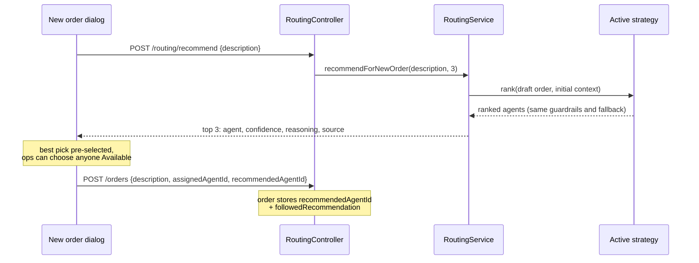

- It is the **same pipeline**: the same candidates, effective load (active + queued suggestions), strategy, AI validation, rule-based fallback and confidence caps. Only the order is a draft with no id and no agent, and **nothing is saved**.
- With **rule-based**, the lightest effective load comes first. With **AI**, the model also weighs the description (fragile, perishable, documents) but is told to prefer the lowest effective load.
- A slower answer never overwrites a newer one: typing again cancels the request in flight. Once ops picks an agent themselves, new answers don't move that choice.
- On create, the order records which agent was recommended and whether ops followed it. Insights shows this as **Recommended pick used** (followed / orders created with a recommendation), and the activity log says "(recommended pick)" or "(recommendation was …)".

---

## 5. Rule-based strategy in detail

`routing/strategy/RuleBasedStrategy.java`. Deterministic: same inputs, same answer, no network.

### The rule

> **Pick the candidate with the lowest *effective load*. Break ties by agent ID.**

```
effective load = active orders (orders they are carrying now)
               + pending suggestions already recommending them
```

Counting pending suggestions matters. Without it, every stranded order in a batch would go to the same "least loaded" agent, because nothing has been accepted yet.

### Confidence

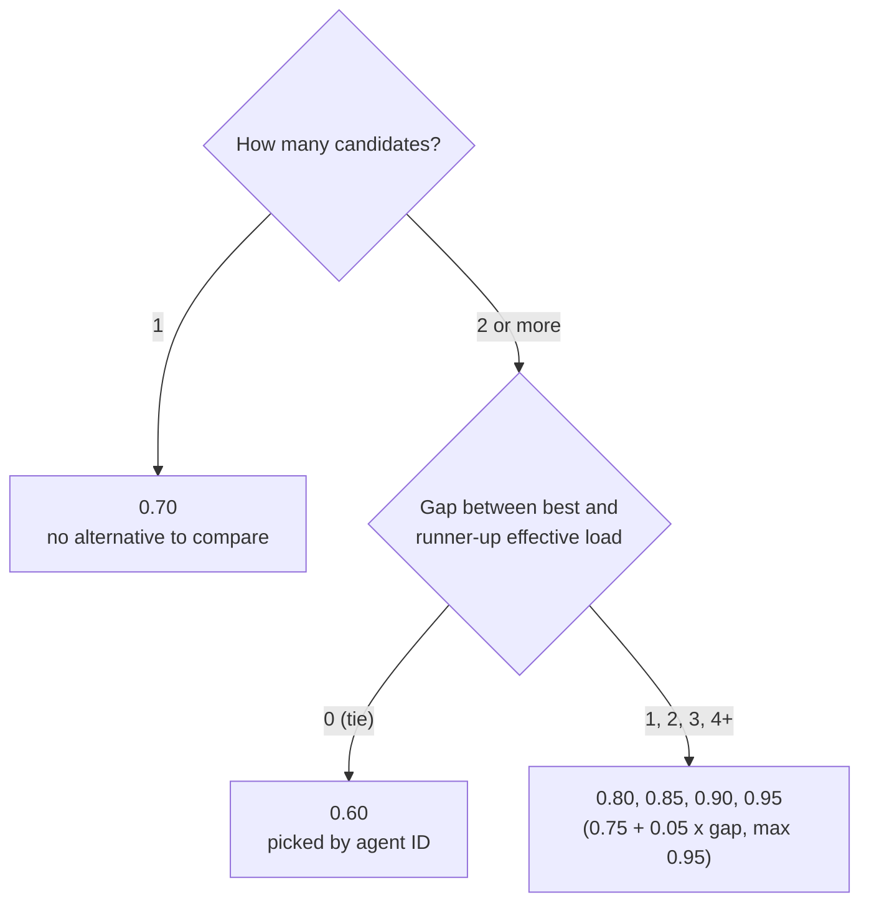

Lower-ranked agents get `0.50 / (1 + how much heavier they are than the best)`, so a runner-up at +1 scores 0.25.

### Worked example (the sample data)

Priya (AGT-001) goes offline holding ORD-001, ORD-002 and ORD-008. Rahul (AGT-002) and Kiran (AGT-004) are Available with 0 orders each.

| Order | Rahul effective | Kiran effective | Pick | Why | Confidence |
|---|---|---|---|---|---|
| ORD-001 | 0 | 0 | **Rahul** | tie, `AGT-002` < `AGT-004` | 0.60 |
| ORD-002 | 0 + **1 pending** = 1 | 0 | **Kiran** | lighter by 1 | 0.80 |
| ORD-008 | 1 | 0 + **1 pending** = 1 | **Rahul** | tie again | 0.60 |

Result: Rahul 2, Kiran 1. The reasoning ops sees, for ORD-002:

> Recovery: Priya Sharma went offline leaving 3 stranded order(s). Kiran Nair has 0 active orders. Lightest load of 2 available agents; next best is Rahul Verma with 0 active orders + 1 pending suggestion.

### When to use it

- The AI is down, slow or out of quota.
- You want instant, predictable, explainable results.
- It's also the fallback for every AI failure, so it must always work.

---

## 6. AI strategy in detail

`routing/strategy/AIRoutingStrategy.java` → `service/ai/AIAdvisorService.java` → `service/ai/PromptBuilder.java` → `routing/gateway/LLMGateway.java`.

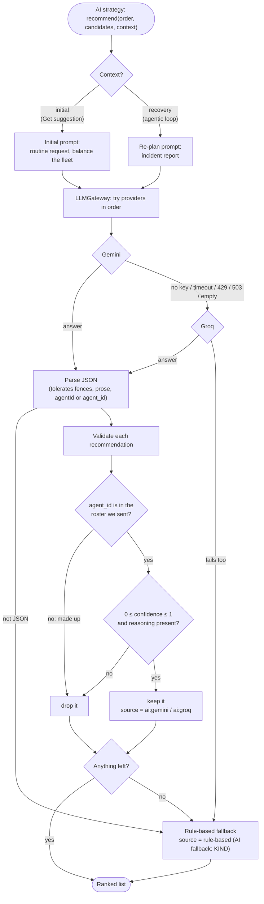

### Two different prompts

The AI gets a different brief depending on the situation (ADR-7). Both share the same agent table and the same JSON answer format.

| | Initial prompt | Re-plan prompt |
|---|---|---|
| Used by | "Get suggestion" / `POST /orders/{id}/suggest` | The agentic loop |
| Framing | "routine assignment request, nothing has failed" | "This is a RECOVERY situation" + incident report |
| Extra facts | the order | who went offline, that their orders are void, **every stranded order in the batch** with the current one marked |
| Priorities | lowest effective load; use the description (fragile, perishable…) | speed; **spread the batch**; **warn about a thin roster** and lower confidence |

The agent table the AI receives looks like this (the same numbers rule-based uses):

```
| id      | name        | active | pending | effective |
|---------|-------------|--------|---------|-----------|
| AGT-002 | Rahul Verma | 0      | 1       | 1         |
| AGT-004 | Kiran Nair  | 0      | 0       | 0         |
```

And it must answer with JSON only:

```json
{"recommendations":[
  {"agent_id":"AGT-004","confidence":0.85,
   "reasoning":"Recovery from Priya Sharma going offline. Kiran Nair has the lowest effective load (0)..."}
]}
```

### The provider chain

`llm.providers=gemini,groq` (env `LLM_PROVIDERS`). Each provider has a 20-second timeout (`LLM_TIMEOUT_MS`).

| What went wrong | Kind | What happens |
|---|---|---|
| Provider has no API key | `NOT_CONFIGURED` | skip to the next provider |
| No answer in time | `TIMEOUT` | next provider |
| Quota exhausted (HTTP 429) | `RATE_LIMITED` | next provider |
| Other HTTP error (Gemini 503 "overloaded" is common) | `HTTP_ERROR` | next provider |
| Empty reply | `EMPTY_RESPONSE` | next provider |
| Reply isn't the JSON we asked for | `UNPARSEABLE` | rule-based fallback |
| Every recommended agent is made up | `HALLUCINATED_AGENT` | rule-based fallback |
| Values unusable (confidence 1.7, blank reasoning) | `INVALID_RESPONSE` | rule-based fallback |

Transport problems try the next provider. Content problems go straight to rule-based, because a second model's opinion doesn't fix something we can check ourselves. Whatever happens, ops gets a suggestion, and its `source` says honestly where it came from.

Typical speed: Gemini 5–9 s, Groq under 1 s, rule-based instant.

---

## 7. Saving a suggestion safely

The AI can take seconds, and the world can change meanwhile. Two checks run at save time, inside a short transaction (`service/suggestion/SuggestionServiceImpl`):

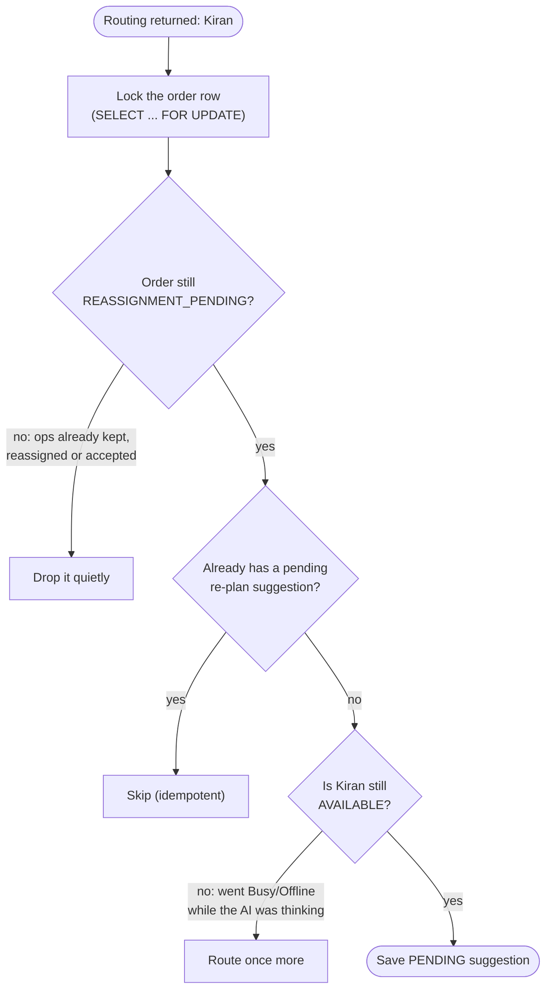

The row lock means two background runs touching the same order can't both insert a suggestion. One waits, then sees the other's.

---

## 8. The ops decisions

| Action | Where in the UI | What happens | Refused when |
|---|---|---|---|
| **Accept** | suggestion card | Order → `REASSIGNED` to the recommended agent; old agent −1 order, new agent +1; other open suggestions for that order → `REJECTED`. All in one transaction. | recommended agent is no longer `AVAILABLE` |
| **Reject** | suggestion card | Suggestion → `REJECTED`; the order keeps waiting. Ask again with **Get suggestion**, or reassign manually. | already decided |
| **Get suggestion** | waiting order with no open suggestion | Routes with the *initial* prompt, streams the reasoning live, saves a "Requested" suggestion. | no `AVAILABLE` candidate |
| **Reassign manually** | any waiting order | Moves the order to the agent ops picked; its open suggestions → `EXPIRED`. | agent not `AVAILABLE`, or it's the same agent |
| **Keep with <agent>** | waiting order whose own agent is `AVAILABLE` again | Order → back to `ASSIGNED` with them; open suggestions → `EXPIRED`. | that agent isn't `AVAILABLE` |
| **Mark delivered** | Orders page, on Assigned/Reassigned orders | Order → `DELIVERED`; its agent gets one fewer active order. | order is still waiting for an agent |

The dropdowns only list agents the server would accept, so a refusal usually means something changed in the last few seconds.

---

## 9. Lifecycles

### Order

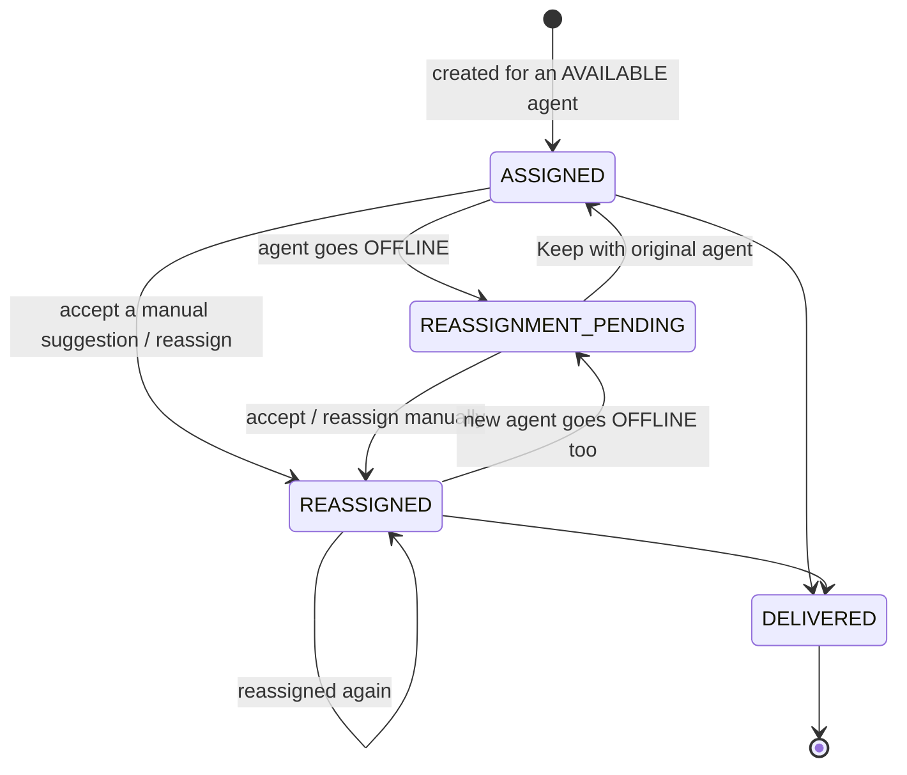

The allowed transitions live on the enum (`domain/OrderStatus.canTransitionTo`), so an illegal move is refused (HTTP 409) wherever it comes from.

### Suggestion

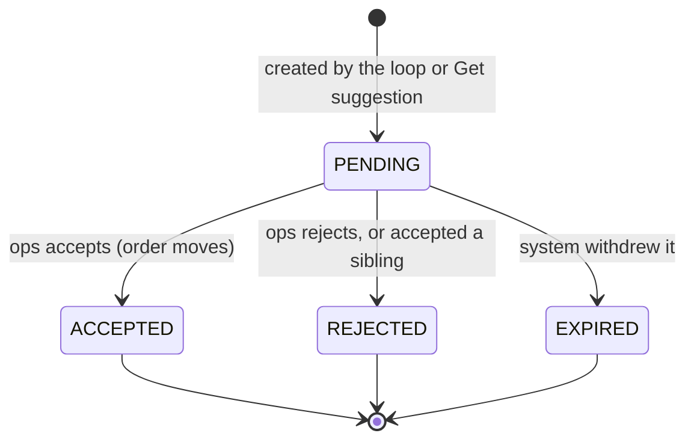

`EXPIRED` means **no human said no**: the recommended agent went Busy/Offline, a new agent became Available (re-balance), or ops kept/reassigned the order another way.

### Agent

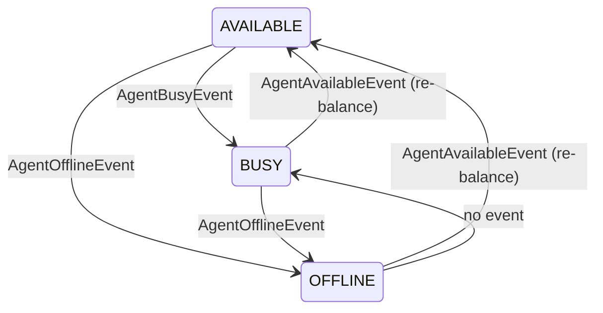

An agent's **active order count** changes only through `Agent.assignOrder()` / `releaseOrder()`: +1 when an order is created for them or moved to them, −1 when an order is moved away or delivered.

---

## 10. Live reasoning (SSE streaming)

"Get suggestion" calls `POST /orders/{id}/suggest/stream`. The answer arrives as Server-Sent Events while the AI is still writing.

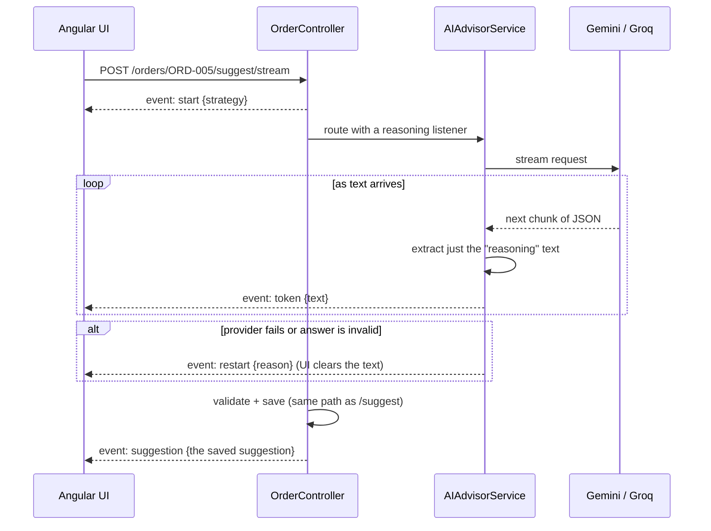

The model replies in JSON. `ReasoningExtractor` decodes only the `reasoning` field as it arrives, so ops reads a sentence forming instead of raw JSON. Gemini sends text in a few large bursts; Groq sends smaller pieces.

---

## 11. Fleet rules and guardrails

| Rule | Why | Enforced in |
|---|---|---|
| At least one agent stays `AVAILABLE` | otherwise routing has no candidates and every stranded order is stuck | `AgentServiceImpl` (rows locked, safe for simultaneous clicks) + disabled buttons in the UI |
| Only `AVAILABLE` agents get new orders (create, reassign, accept, keep) | `BUSY` means "not taking more" | `OrderServiceImpl`, `SuggestionServiceImpl` + filtered dropdowns |
| AI answers are checked against the real roster | models sometimes invent IDs | `AIRoutingStrategy.validate` |
| Confidence is capped on a thin roster (0.60) or a single candidate (0.75) | no strategy should sound certain when the fleet can't back it up | `RoutingService.applyRosterLimits` |
| Silent agents are taken off duty automatically | a dead phone or a crash shouldn't wait for someone to notice | `HeartbeatMonitor` + `AgentServiceImpl.markOfflineIfSilentSince` |
| A suggestion is re-checked right before saving | the roster can change while the AI thinks | `SuggestionServiceImpl.createSuggestion` |
| Order status changes follow the state machine | no impossible jumps (e.g. DELIVERED → ASSIGNED) | `OrderStatus.canTransitionTo` |
| Errors always have one JSON shape | the UI can show the server's message | `exception/GlobalExceptionHandler` |

---

## 12. Things you might not know

- **The strategy toggle is remembered.** It's saved in the database, so a restart keeps your choice. `ROUTING_STRATEGY` only applies until someone switches for the first time.
- **Every change is in the activity log.** Status changes, suggestions, decisions, reassignments and strategy switches are all recorded with `ops` or `system` as the actor (Insights page, or `GET /activity`).
- **"Get suggestion" uses the *initial* prompt even for a stranded order**, and its card is tagged "Requested". Only the background loop uses the recovery prompt.
- **Rejecting doesn't automatically ask again.** The order waits until ops clicks Get suggestion, reassigns, or an agent status change triggers a re-plan.
- **Becoming Available replaces suggestions on screen.** A re-balance withdraws and recreates every waiting order's suggestion. If you click Accept on one being replaced, you'll get a message; the next refresh shows the new one.
- **An offline agent's order count doesn't drop immediately.** It falls as their orders are accepted, reassigned or delivered, so the roster may show an Offline agent still "holding" orders.
- **Pending load counts every open suggestion**, including manual ones on unrelated orders. An agent with many unanswered suggestions looks busier to routing.
- **Each AI call costs time and quota.** A re-balance of 8 waiting orders with Gemini takes around a minute; rule-based is instant.
- **The test suite never calls a real AI.** It uses a fake provider that lives only in `src/test` and can simulate each failure (timeout, quota, garbage, made-up agent). The running app uses only Gemini and Groq.
- **You can inspect the database** at http://localhost:8080/h2-console (JDBC URL `jdbc:h2:file:./data/ziprun-db`, user `sa`, empty password). The path is relative to the folder the backend was started from, normally `backend/reassignment-engine`.
- **The backend log tells the story.** Search for `AGENTIC LOOP` to see each trigger and its outcome (`queued / skipped / no available agent / failed`), and `LLM provider` to see which AI answered and how long it took.
- **Background work runs on 2 threads** (`spring.task.execution.pool.*`), so simultaneous status changes queue up rather than run all at once.

---

## 13. Known limitations

Honest list of what isn't solved yet (most are on the Roadmap in the README):

| Limitation | Impact | Possible fix |
|---|---|---|
| Heartbeats come from a browser simulator, not a real agent app | Automatic offline detection works, but needs an app to send heartbeats | Build the agent app (on the Roadmap) |
| Background events aren't durable | If the backend dies mid-loop, unfinished orders wait for the next trigger | Outbox table or a message broker |
| Schema comes from `ddl-auto=update` | Adding an enum value needs a manual `ALTER` on existing H2 databases | Flyway migrations |
| No authentication | Anyone who can reach the API can change statuses or the strategy | Spring Security |
| UI polls every 3 seconds | Up to 3 s delay, constant small requests | Push updates over SSE/WebSocket |
| Single backend instance assumed | In-process events and the heartbeat monitor run per instance | A message broker, and one elected monitor |

---

## 14. Troubleshooting

| You see | Likely cause | What to do |
|---|---|---|
| Every suggestion says `rule-based (AI fallback: NOT_CONFIGURED)` | No API key reached the backend | Set `GEMINI_API_KEY` / `GROQ_API_KEY` *before* starting it |
| Many `ai:groq` tags | Gemini returned 503 "overloaded" or timed out; Groq stepped in | Normal; nothing to fix |
| A waiting order has no suggestion | No other agent is Available (its own agent is excluded) | Make an agent Available, or use **Keep with …** if its agent is back |
| "X is the only AVAILABLE agent…" (409) | The last-available guardrail | Make another agent Available first |
| Accept fails with "…isn't taking new orders" | The recommended agent went Busy/Offline since the suggestion was made | Wait for the refresh; a new suggestion replaces it |
| Backend won't start: `UnsupportedClassVersionError` | Running on Java 8/11 | Use Java 17+ (`JAVA_HOME`), or run with `docker compose up --build` |
| An agent went Offline on their own | Their app stopped sending heartbeats (see the note on their Fleet card) | Set them Available again when they're back on shift |

---

## 15. History and metrics (Insights)

The **Insights** page answers "is the AI actually better than rule-based?" from real decisions.

| Metric | How it's calculated |
|---|---|
| Acceptance rate (per source and overall) | accepted ÷ (accepted + rejected). `EXPIRED` suggestions were withdrawn by the system, not judged by a person, so they don't count either way. |
| AI fallback rate | rule-based fallbacks ÷ (AI answers + fallbacks): how often the AI was tried but couldn't answer |
| Average confidence | mean confidence of suggestions from that source |
| Response time | average and 95th-percentile `routingMillis` (time to produce a suggestion, AI calls included). Suggestions created before timing existed show "-". |
| AI providers | how many AI suggestions Gemini and Groq each produced |

Sources are read from each suggestion's `source`: `ai:*` → AI, `…fallback…` → AI fallback, `rule-based` → Rule-based, empty → "Before tracking".

The **activity log** (`activity_log` table, `GET /activity`) records every meaningful change: agent status (by ops, or automatic), orders created/delivered/reassigned/kept, suggestions created/accepted/rejected/withdrawn, and strategy switches. Each entry is written in the same transaction as the change it describes, so the log never shows something that didn't actually happen.
